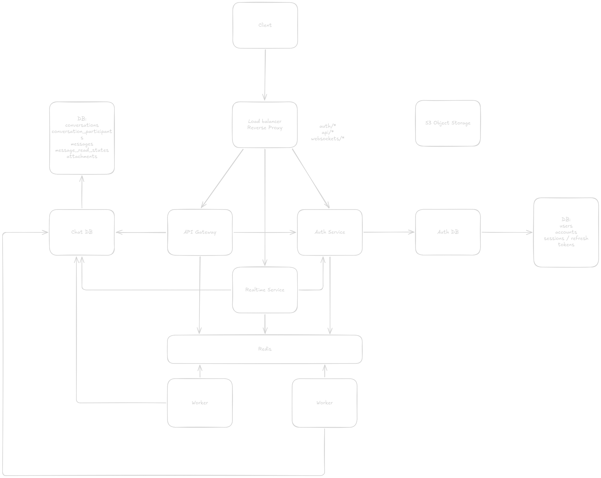

<div align="center">

# 💬 Chatty Nest

**A real-time chat platform — built as a DDD monolith, engineered for distributed scale.**

[](https://nodejs.org)
[](https://www.typescriptlang.org)
[](https://nestjs.com)
[](https://orm.drizzle.team)
[](https://www.postgresql.org)
[](https://pnpm.io)
[](https://nx.dev)
[](./LICENSE)

</div>

---

## What is Chatty Nest?

Chatty Nest is a real-time chat application built from the ground up with a clear architectural goal: **start as a clean, well-structured monolith and scale into a fully distributed microservices system** without painful rewrites.

It follows **Domain-Driven Design (DDD)** and **Clean Architecture** principles across all bounded contexts. Each module is self-contained with its own domain, application, and infrastructure layers — making service extraction a mechanical task when the time comes, not an architectural overhaul.

The HTTP layer uses **uwestjs** (a NestJS adapter for [uWebSockets.js](https://github.com/uNetworking/uWebSockets.js)), chosen deliberately over Express for its dramatically higher throughput and native WebSocket support — a foundation the real-time messaging layer will rely on.

---

## Proposed Distributed Architecture

The monolith is a stepping stone. Below is the target distributed design this codebase is being structured toward:



The vision covers an API Gateway routing to dedicated microservices for auth, messaging, notifications, presence, and media — all communicating via a message broker with a shared caching layer and isolated databases per service.

---

## Current State

The following auth foundation is implemented within the monolith:

### Auth Module

- **Registration & Login** via email/password with Argon2 password hashing
- **JWT access tokens** using RS256 (asymmetric keys) — public key verifiable without the private key, which matters when other microservices need to verify tokens independently
- **Refresh token rotation** via httpOnly cookies — each refresh invalidates the old token and issues a new one
- **Session management** — list all active sessions, revoke a specific session, or revoke everything at once
- **Password change** — automatically invalidates all active sessions on success
- **RBAC** — role-based access control with a defined hierarchy (`USER` → `ADMIN`), enforced through the global JWT and roles guards
- **Ban system foundation** — domain model, schema fields, and session-revocation listener are in place; admin-facing ban APIs are planned
- **Device tracking** — sessions record IP address and User-Agent for each active login
- **Admin impersonation foundation** — session schema supports `impersonatedBy`; the user-facing API is planned
- **CLS (Continuation Local Storage)** — request-scoped metadata (`requestId`, `ip`, `userAgent`, `url`) is propagated without prop-drilling

### Infrastructure

- **Drizzle ORM** with a connection-pooled PostgreSQL setup, validated on startup
- **Zod-validated configuration** — the app refuses to start if environment variables are missing or malformed
- **Domain events** — an in-process `DomainEventsPublisher` dispatches aggregate events (e.g. `UserBanned` → `UserBannedListener` → revoke sessions). This will transition to a message broker during the microservices migration
- **Interactive API docs** — Scalar UI served at `/api/reference`, OpenAPI spec at `/api/openapi.json`

### Planned

| Area                       | Description                                               |
| -------------------------- | --------------------------------------------------------- |
| Real-time messaging        | WebSocket channels for 1-on-1 and group chat              |
| Message persistence        | Append-only message store with read receipts              |
| Presence service           | Online/offline/typing indicators                          |
| Notifications              | Push + in-app, event-driven                               |
| Message queue              | Replace in-process events with a broker (NATS / RabbitMQ) |
| Caching layer              | Redis for session state, presence, rate limiting          |
| Rate limiting / throttling | Per-user and per-IP request throttling                    |
| Email verification         | Token-based email confirmation flow (schema ready)        |
| OAuth providers            | Google, GitHub (account schema already supports it)       |
| Microservices extraction   | Auth, Messaging, Notifications as independent services    |

---

## Tech Stack

| Layer             | Technology                          | Why                                                       |
| ----------------- | ----------------------------------- | --------------------------------------------------------- |
| Runtime           | Node.js 20+                         | LTS, native crypto, stable ESM                            |
| Language          | TypeScript 5.9                      | Strict mode, `nodenext` module resolution                 |
| Framework         | NestJS 11                           | DI, modular architecture, decorator-driven                |
| HTTP/WS Adapter   | uwestjs (uWebSockets.js)            | 10x Express throughput, native WebSocket support          |
| ORM               | Drizzle ORM                         | Type-safe, schema-first, zero magic                       |
| Database          | PostgreSQL 18                       | JSONB, full-text, reliable                                |
| Password Hashing  | Argon2                              | OWASP recommended, PHC winner                             |
| Auth              | Passport + JWT (RS256)              | Asymmetric keys — services verify without the private key |
| Request Context   | nestjs-cls                          | Scoped storage without explicitly threading context       |
| Config Validation | Zod                                 | Schema-first, fail-fast on startup                        |
| DTO Validation    | class-validator + class-transformer | Declarative, whitelist-enforced                           |
| API Docs          | Scalar + @nestjs/swagger            | Beautiful interactive docs, OpenAPI 3.x                   |
| Monorepo          | Nx 22                               | Smart task runner, dependency graph, caching              |
| Package Manager   | pnpm                                | Disk-efficient, strict hoisting                           |
| Build             | SWC                                 | ~64ms transpilation, decorator support                    |
| Testing           | Jest + SWC                          | Fast compilation, good DX                                 |

---

## Architecture Deep Dive

### DDD Layer Structure

Every bounded context (starting with `auth`) follows the same four-layer pattern:

```
modules/auth/
├── domain/               # Pure business logic — zero framework dependencies
│   ├── aggregates/       # User, Account — enforce invariants, emit events
│   ├── entities/         # Session — identity without full aggregate lifecycle
│   ├── value-objects/    # RoleType, AuthProvider — immutable domain concepts
│   └── events/           # UserCreated, UserBanned, UserRoleChanged, etc.
│
├── application/          # Orchestration — depends on domain, not infrastructure
│   ├── services/         # AuthService — coordinates aggregates and ports
│   ├── ports/            # Interfaces: UsersRepository, PasswordHasher, etc.
│   └── listeners/        # UserBannedListener — reacts to domain events
│
├── infrastructure/       # Framework-specific implementations
│   ├── repositories/     # Drizzle implementations of repository ports
│   ├── guards/           # JwtAuthGuard, RolesGuard
│   ├── strategies/       # JwtAuthStrategy (passport)
│   └── hasher/           # Argon2PasswordHasher
│
└── presentation/         # HTTP surface
    ├── controllers/      # AuthController
    └── dto/              # Request (RegisterDto, LoginDto) and response shapes
```

The key principle: **the domain layer knows nothing about NestJS, Drizzle, or HTTP**. It only depends on plain TypeScript. This means domain logic is trivially unit-testable and can be moved to any service without modification.

### Shared Kernel

```
shared-kernal/
├── domain/
│   ├── aggregates/root.aggregate.ts   # Base class: addEvent, getEvents, clearEvents
│   ├── events/domain.event.ts         # Base class: eventId, occurredOn, eventName
│   └── value-objects/role.vo.ts       # ROLE_HIERARCHY, hasRequiredRole()
└── infrastructure/
    └── decorators/
        ├── public.decorator.ts        # @isPublic() — skip JWT guard
        └── roles.decorator.ts         # @Roles('ADMIN') — declarative RBAC
```

### Domain Events Flow

```
AuthService.register()
  └── User.create()
        └── user.addEvent(new UserCreatedEvent(...))
  └── domainEventsPublisher.publishEventsForAggregate(user)
        └── eventEmitter.emitAsync('UserCreatedEvent', event)

AuthService (ban user, future)
  └── user.ban(reason, expires)
        └── user.addEvent(new UserBannedEvent(...))
  └── domainEventsPublisher.publishEventsForAggregate(user)
        └── UserBannedListener.handle(event)
              └── sessionsRepository.deleteAllByUserId(event.userId)
                    # All sessions immediately invalidated
```

This event bus is in-process today. During the microservices migration, it becomes a message broker topic — the listener structure stays identical.

### Why RS256 over HS256?

RS256 uses an asymmetric key pair. The auth service signs with the **private key**. Every other microservice verifies with the **public key** — which can be distributed freely. This means downstream services (messaging, notifications, etc.) can verify token authenticity without ever holding the private key, a critical security property in a distributed system.

---

## Database Schema

```
users
  ├── id, name, email, emailVerified, image
  ├── role (ADMIN | USER)
  ├── banned, banReason, banExpires
  ├── username, displayUsername, displayName, bio
  ├── preferences (JSONB: theme, lang, timezone, notifications)
  └── createdAt, updatedAt

accounts                           # One user → many auth providers
  ├── id, userId → users.id
  ├── providerId (email | google | github | saml | oidc | phone)
  ├── accountId (email address or OAuth subject)
  ├── passwordHash                 # Only for providerId = 'email'
  ├── accessToken, refreshToken, idToken, scope
  └── accessTokenExpiresAt, refreshTokenExpiresAt

sessions
  ├── id, userId → users.id
  ├── token (unique refresh token)
  ├── expiresAt
  ├── impersonatedBy               # Admin impersonation support
  ├── ipAddress, userAgent
  └── createdAt, updatedAt

verifications                      # Email/phone/password-reset tokens
  ├── id, userId, identifier
  ├── value (the token)
  └── expiresAt, createdAt, updatedAt
```

The schema follows **Better Auth** conventions, making a future migration to Better Auth straightforward if desired.

---

## Project Structure

```
chatty-nest/
├── apps/
│   ├── api/                        # NestJS application (uwestjs adapter)
│   │   ├── src/
│   │   │   ├── main.ts             # Bootstrap: uWS adapter, global pipes, Swagger
│   │   │   ├── app.module.ts       # Root module
│   │   │   ├── app/
│   │   │   │   ├── config/         # Zod-validated app + database config
│   │   │   │   ├── database/       # DrizzleModule (dynamic, global)
│   │   │   │   ├── docs/           # Scalar UI + OpenAPI endpoint
│   │   │   │   └── events/         # DomainEventsPublisher (global)
│   │   │   ├── modules/
│   │   │   │   └── auth/           # Auth bounded context (DDD, 4 layers)
│   │   │   └── shared-kernal/      # AggregateRoot, DomainEvent, Role VO
│   │   └── ...
│   └── api-e2e/                    # End-to-end tests (Jest + axios)
│
├── packages/
│   ├── database/                   # Shared Drizzle schema + migrations
│   │   ├── src/schemas/identity/   # users, accounts, sessions, verifications
│   │   └── drizzle/                # Migration SQL + snapshots
│   └── shared-utils/               # validateConfig() Zod helper
│
└── docker/
    └── compose.yaml                # PostgreSQL 18.3-alpine
```

---

## Quick Start

### Prerequisites

- **Node.js** 20+
- **pnpm** — `npm install -g pnpm`
- **Docker** — for PostgreSQL

### 1. Clone and install

```bash
git clone https://github.com/ahm4dd/chatty-nest.git
cd chatty-nest
pnpm install
```

### 2. Start PostgreSQL

```bash
docker compose -f docker/compose.yaml up -d
```

### 3. Configure environment

```bash
cp apps/api/.env.example apps/api/.env
```

### 4. Generate RS256 keys

The app uses RS256 JWT. Generate a key pair and load it into `.env`:

```bash
# Generate private + public key
openssl genpkey -algorithm RSA -out private.pem -pkeyopt rsa_keygen_bits:2048
openssl rsa -pubout -in private.pem -out public.pem

# Base64-encode and append to .env (single-line, no newlines)
echo "JWT_PRIVATE_KEY=$(base64 -i private.pem | tr -d '\n')" >> apps/api/.env
echo "JWT_PUBLIC_KEY=$(base64 -i public.pem | tr -d '\n')"   >> apps/api/.env

# Clean up — never commit the raw PEM files
rm private.pem public.pem
```

> **Why base64?** `.env` files don't support multi-line values. The app decodes them at startup.

### 5. Push the database schema

```bash
pnpm nx run api:db:push
```

### 6. Start the dev server

```bash
pnpm nx run api:serve
```

The server starts at **http://localhost:3000**.
Interactive API docs are available at **http://localhost:3000/api/reference**.

---

## Environment Variables

| Variable                           | Default       | Required | Description                                    |
| ---------------------------------- | ------------- | -------- | ---------------------------------------------- |
| `NODE_ENV`                         | `development` | No       | `development` / `production` / `test`          |
| `PORT`                             | `3000`        | No       | HTTP server port                               |
| `DATABASE_URL`                     | —             | **Yes**  | PostgreSQL connection string                   |
| `DATABASE_POOL_MIN`                | `2`           | No       | Minimum pool connections                       |
| `DATABASE_POOL_MAX`                | `10`          | No       | Maximum pool connections                       |
| `DATABASE_POOL_IDLE_TIMEOUT`       | `10000`       | No       | Idle connection timeout (ms)                   |
| `DATABASE_POOL_CONNECTION_TIMEOUT` | `5000`        | No       | Connection acquisition timeout (ms)            |
| `JWT_PRIVATE_KEY`                  | —             | **Yes**  | RS256 private key, base64-encoded, no newlines |
| `JWT_PUBLIC_KEY`                   | —             | **Yes**  | RS256 public key, base64-encoded, no newlines  |
| `JWT_EXPIRATION`                   | `3600`        | No       | Access token TTL in seconds                    |
| `JWT_REFRESH_EXPIRES_IN`           | `7d`          | No       | Refresh token TTL (`s`, `m`, `h`, `d` units)   |

Validation is enforced at startup via Zod — the application will refuse to boot with a clear error message if any required variable is missing or invalid.

---

## API Reference

All endpoints are prefixed with `/api`. Interactive docs at `/api/reference`.

### Auth — `/api/auth`

| Method   | Endpoint                    | Auth           | Description                                                        |
| -------- | --------------------------- | -------------- | ------------------------------------------------------------------ |
| `POST`   | `/auth/register`            | Public         | Register a new account. Returns access token + sets refresh cookie |
| `POST`   | `/auth/login`               | Public         | Authenticate. Returns access token + sets refresh cookie           |
| `POST`   | `/auth/refresh`             | Cookie         | Rotate the refresh token. Returns a new access token               |
| `POST`   | `/auth/logout`              | Bearer         | Revoke the current session and clear the refresh cookie            |
| `GET`    | `/auth/me`                  | Bearer         | Current user profile + active session info                         |
| `GET`    | `/auth/sessions`            | Bearer         | List all active sessions with device info                          |
| `DELETE` | `/auth/sessions/:sessionId` | Bearer         | Revoke a specific session by ID                                    |
| `DELETE` | `/auth/sessions`            | Bearer         | Revoke all sessions (sign out everywhere)                          |
| `PUT`    | `/auth/password`            | Bearer         | Change password — invalidates all sessions                         |
| `GET`    | `/auth/admin`               | Bearer + ADMIN | Admin-only route example                                           |

#### Register / Login Response

```json
{
  "accessToken": "eyJ...",
  "refreshToken": "uuid-v4-token",
  "user": {
    "id": "uuid",
    "email": "user@example.com",
    "role": "USER"
  }
}
```

> The `refreshToken` is also set as an `httpOnly` cookie named `refreshToken`.

---

## Development Commands

| Command                          | Description                             |
| -------------------------------- | --------------------------------------- |
| `pnpm nx run api:serve`              | Start dev server with hot reload (SWC watch + node watch) |
| `pnpm nx run api:serve:production`  | Start production server                          |
| `pnpm nx run api:build`             | Production build (SWC)                          |
| `pnpm nx run api:test`           | Run unit tests                          |
| `pnpm nx run api:lint`           | ESLint check                            |
| `pnpm nx run api:typecheck`      | TypeScript type-check (0 errors policy) |
| `pnpm nx run api:db:push`        | Push Drizzle schema to database (dev)   |
| `pnpm nx run api:db:generate`    | Generate a new migration file           |
| `pnpm nx run api:db:migrate`     | Run pending migrations                  |
| `pnpm nx run api:db:studio`      | Open Drizzle Studio GUI                 |
| `pnpm nx run api-e2e:e2e`        | Run end-to-end tests                    |
| `pnpm nx affected --target=test` | Run tests only for changed code         |
| `pnpm nx graph`                  | Visual dependency graph of the monorepo |

### Docker

```bash
# Start PostgreSQL
docker compose -f docker/compose.yaml up -d

# Stop and remove containers
docker compose -f docker/compose.yaml down

# Wipe volume (fresh database)
docker compose -f docker/compose.yaml down -v
```

---

## Motivation & Design Decisions

**Monolith-first** — Faster iteration, simpler deployment, easier reasoning. Each bounded context is a NestJS module with its own domain layer. The shared-kernel provides base classes (`AggregateRoot`, `DomainEvent`) that every future service will reuse. Extracting a module into a standalone service is a matter of wiring, not rearchitecting.

**uwestjs over Express** — uWebSockets.js has significantly higher throughput and lower latency than Express, and provides the same WebSocket interface that the messaging layer will depend on. Avoiding the migration cost later by starting with the right adapter now.

**RS256 over HS256** — Symmetric keys (HS256) require every service that validates tokens to hold the secret. Asymmetric RS256 allows the private key to live exclusively in the auth service, while all other services verify tokens using only the distributable public key.

**Domain events, not direct calls** — Cross-context side effects (e.g. "ban user → revoke sessions") are handled by events, not direct service-to-service method calls. Today this runs in-process via NestJS EventEmitter. When the auth and session services split into separate processes, the listener becomes a subscriber on a message broker topic. No domain logic changes.

**Zod for config, class-validator for DTOs** — Zod is used at the infrastructure boundary (environment config) where schema-first, composable parsing is ideal. class-validator is used for HTTP request DTOs where decorator-based validation integrates cleanly with NestJS pipes.

---

## Contributing

1. **Lint must pass** — `pnpm nx run api:lint` with no new errors
2. **Types must be clean** — `pnpm nx run api:typecheck` with 0 errors
3. **Tests for new features** — unit tests in the same module, e2e tests for new endpoints
4. **Follow the DDD module structure** — new bounded contexts get their own `domain/`, `application/`, `infrastructure/`, `presentation/` layers
5. **No cross-context imports** — modules communicate through domain events or explicit application service ports, never by importing each other's internals

---

<div align="center">

Built with care. Designed to scale. &nbsp;·&nbsp; MIT License

</div>
